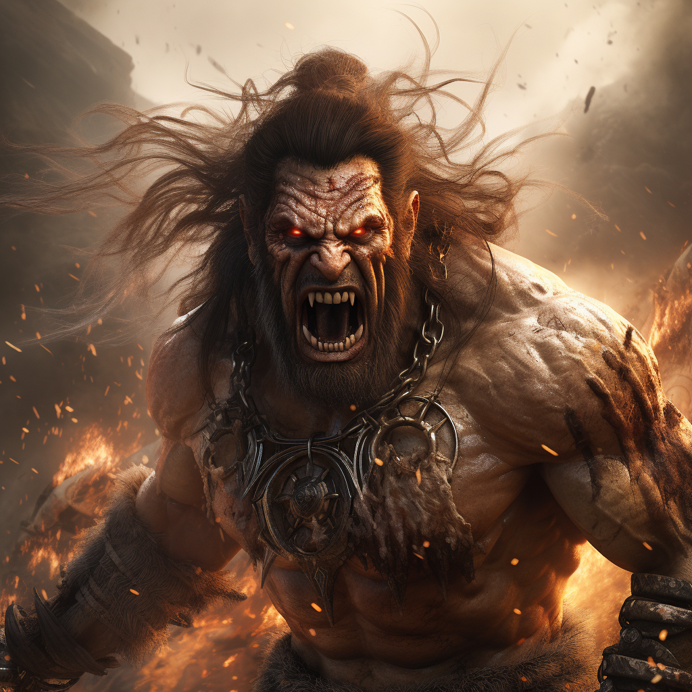

# Berserker

Berserker opiera się na szale bojowym, który sieje zamęt wśród przeciwników.

# Talenty

**Niekontrolowany szał:**

Fart podczas ataku: Wpadasz w szał.\
Poziom szału równy ilości zadanych ran.

**Obalenie:**

Możesz poświęcić jeden sukces przy zadawaniu obrażeń aby [przewrócić](docs/docs/efekty/przewrocony.md) przeciwnika.

**Zagryzienie leżącego:**

Dodaj swój poziom do rzutów przeciwko [przewróconym](docs/docs/efekty/podpalenie.md) przeciwnikom.

**Ognisty talent:**

Dodaj połowę swojego poziomu do wszystkich rzutów z tej ścieżki.

# Zdolności:

S - ilość sukcesów w rzucie kośćmi many

___

**Szał**

Zdolność pasywna
Trudność: 5

Wpadasz w szał bojowy. Każdy S dodaje poziom efektu szału.

Za każdy poziom szału dodaj połowę poziomu postaci do rzutu ataku.\
Minimum +1 za każdy poziom efektu.

Efekt nie zmniejsza się i trwa do końca walki.
___
**Desperacki atak**

Zdolność ofensywna.

Atakujesz nie zważając na konsekwencje.\
Możesz dodać swoje kości życia przy ataku. Każda wykorzystana kość zadaje Ci ranę.
Możesz łączyć desperacki atak z innymi zdolnościami.
___
**Szarża**

Ofensywna zdolność bojowa.

Dodaj +kość many za każdy krok przed atakiem.
___
**Roztrzaskanie czaszek**

Ofensywna zdolność bojowa.

Atakujesz dwóch przeciwników stojących obok siebie.\
Łapiesz ich za głowy i zderzasz ich czaszki.
# [Zdolność epicka](/docs/zdolnosc-epicka.md):

**Skok w tłum**

Ofensywna zdolność obszarowa.

Przeskakujesz nad głowami przeciwników i lądujesz pomiędzy nimi.

Możesz przechodzić przez pola przeciwników (przeskakujesz nad nimi).\
Atakujesz wszystkich w okół siebie.\
Każdy kto otrzymał obrażenia jest [przewrócony](/docs/przewaga.md).\
Ty też.

Bazowy koszt many: 2M

Możesz wydać dodatkowe 2M aby utrzymać się na nogach.
