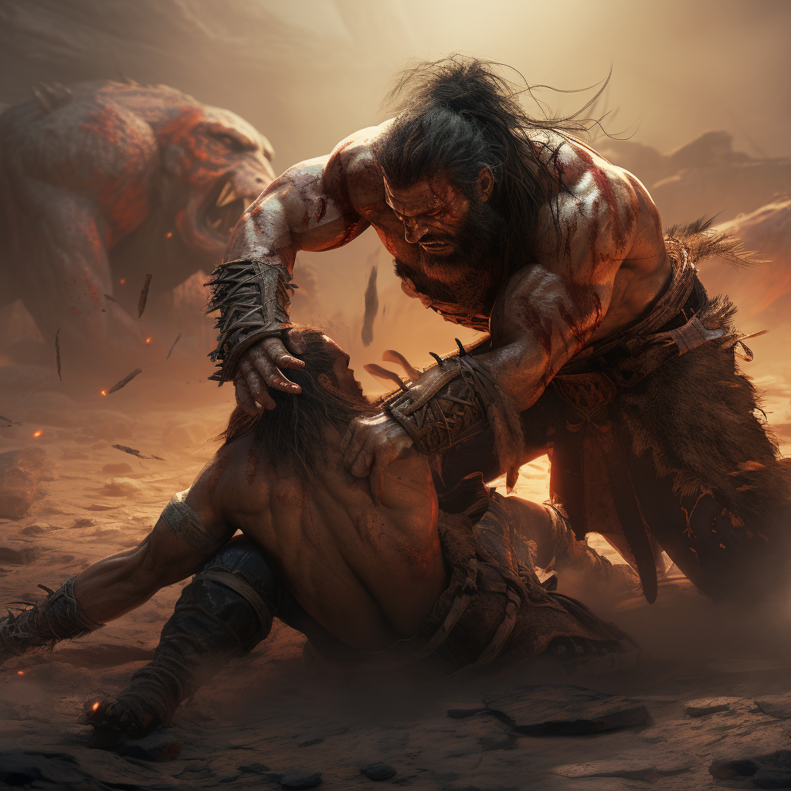

# Tytan

Tytan wykorzystuje swoja siłę aby chwytać przeciwników i ciskać nimi w innych wrogów.

# Zdolności:

S - ilość sukcesów w rzucie kośćmi many

___

**Pochwycenie**

Atak z bliska przeciwko życiu.

[Chwytasz](/docs/efekty/pochwycony.md) dwóch przeciwników.
___
**Obezwładnienie**

Atak przeciwko kości życia pochwyconego przeciwnika.
Bazowy koszt: +2M za drugi cel.

Przyciskasz przeciwnika do ziemi. Wykręcasz mu ręce. Zakładasz nelsona.

Odejmij S kości many przeciwnika.
___

**Połamanie nóg**
Bazowy koszt: +2M za drugi cel.

Atak przeciwko kości życia pochwyconego przeciwnika.

Łamiesz nogi przeciwnika. Przeciwnik traci S kroków do końca walki.
___

**Ciśnięcie przeciwnikiem**

Atak przeciwko kości życia pochwyconego przeciwnika.
Trudność: Kość życia przeciwnika.

Ciskasz przeciwnikiem o S kroków. Przeciwnik może [uderzyć w ścianę](/docs/uderzenie-w-sciane.md). Jeżeli uderzy w inną postać - obie otrzymują obrażenia.

Ciśnięta postać nie jest już pochwycona.
___
**Ciśnięcie sojusznikiem**

Trudność: 5

Możesz cisnąć sojusznikiem o S pól. Taki sojusznik dodaje S kości many do zdolności której użyje w wyniku ciśnięcia.
# [Zdolność epicka](/docs/zdolnosc-epicka.md):

**Rozkwaszenie**

Atak przeciwko kości życia pochwyconych przeciwników.

Nieważne ilu przeciwników trzymasz w pochwyceniu. Zadajesz obrażenia wszystkim.
Możesz dodać inspirację do kości many.

# Talenty

**Dodatkowe pochwycenie:**

Efekt pochwycenia +1S

**Mocniejsze ciśnięcie:**

Ciskasz przeciwnika o jeden krok dalej.

**Łamanie kończym:**

Łamiąc nogi, łamiesz też ręce. Dodaj karę przeciwnikowi do testów - tego samego poziomu co do kroków.
