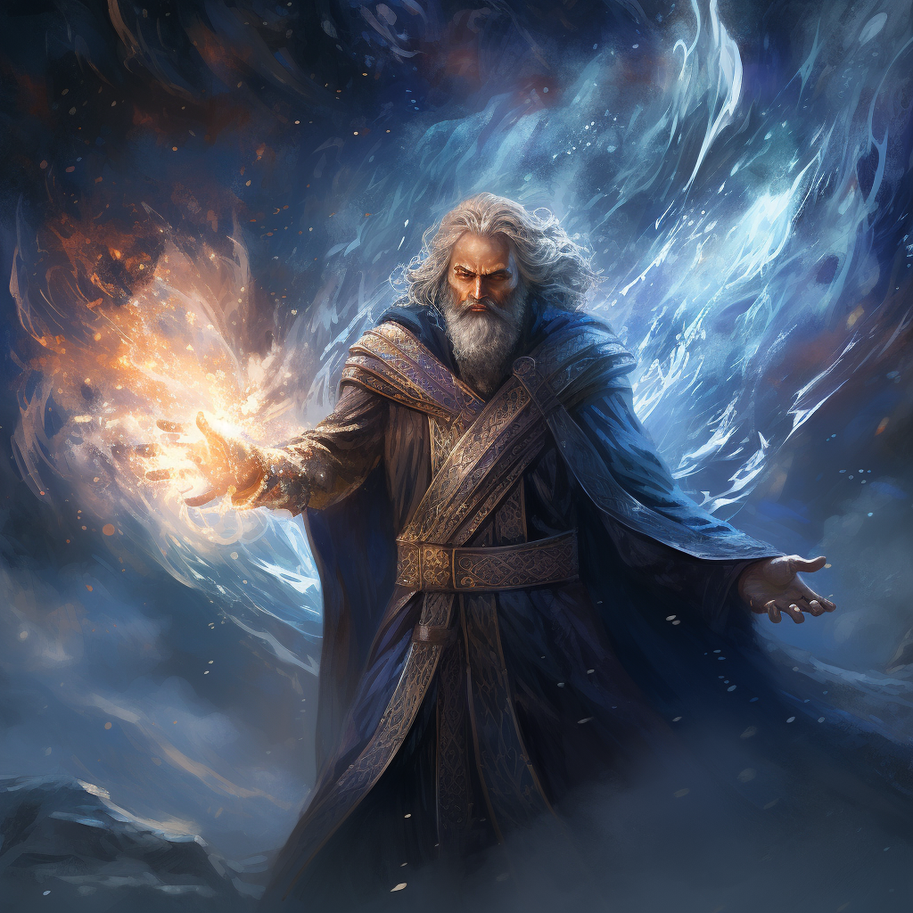

# Elementalista

Elementalista włada żywiołami ognia, wiatru i powietrza.

# Ścieżki:

## Ogień

### Zdolności:

**Ognisty pocisk**

`Atak dystansowy`

`Atak dystansowy`

Zadaje obrażenia od ognia.

