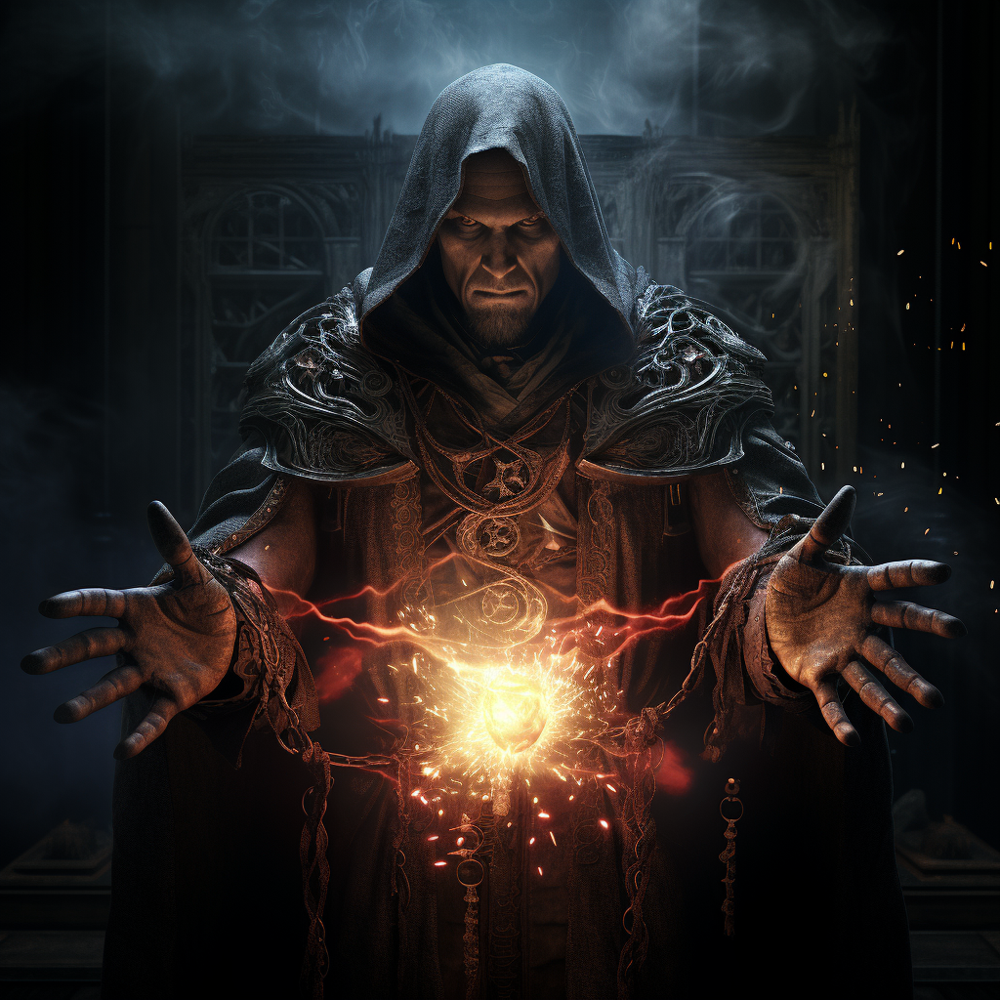

# Czarna Magia

Ścieżka czarnej magii.



# Zdolności:

S - ilość sukcesów w rzucie kośćmi many

___

**Włócznia z kosci**

Atak z dystansu

Zadajesz S ran od cienia.

Jeżeli za pierwszym celem stoi inny wróg, możesz wydać dodatkową manę aby włócznia przebiła pierwszego i atakowała kolejny cel.

Rzuć kośćmi many w ilości 2x ekstra mana.
Ilość kości nie może przekroczyć kości rzucanych przeciwko poprzedniemu przeciwnikowi.

Jeżeli za drugim celem jest kolejny, włócznia może przebić dalej.

```
Przykład:

Nekromanta posiadający 8k8 many atakuje przeciwnika włócznią z kości.
Wydaje 4 many.

Za pierwszym przeciwnikiem znajduje się kolejny. Nekromanta wydaje kolejne 2 many aby rzucić 4 kości obrażeń.

Za drugim przeciwnikiem znajduje się trzeci. Nekromanta wydaje ostatnie 2 punkty many aby w niego uderzyć za 4 kości obrażeń.
```

___
**Ciemność**

Zdolność dystansowa.\
Trudność: 5

Tworzy magiczną [ciemność](/docs/efekty/ciemnosc.md) na S polach.
___
**Ściana z kości**

Magiczny efekt dystansowy.
Trudność: 5

Tworzysz ścianę z kości. Przeciwnicy nie mogą przez nią przejść bez zniszczenia jej.

Wybierz jej kształt i siłę.
Podziel S pomiędzy:
* Ilością pól ściany (ściana nie musi mieć linii prostej)
* Ilością kości życia (ich rodzaj to twoja kość many)
```
Przykład:

Nekromanta z kością many k8 uzyskał 5S.
Tworzy ścianę o długości 3 w kształcie litery L.
Żeby zniszczyć ścianę przeciwnik musi zadać dwie rany przeciwko kości życia k8.
```
___
**Wybuch zwłok**

Dystansowy efekt obszarowy, wymaga ciała.

Eksplodujesz ciało, raniąc wszystkich dookoła.

Wszyscy w okół ciała otrzymują S obrażeń od cienia.
# [Zdolność epicka](/docs/zdolnosc-epicka.md):

**Wielki wybuch zwłok**

Powodujesz wybuch zwłok wszystkich zwłok w zasięgu.

Możesz zdecydować się na pominięcie wybranych.

Bazowy koszt many: 3M

# Talenty

**Ostra włócznia:**

Możesz zignorować ograniczenie przy włóczni z kości. O ile pierwszy cel dostał jakiekolwiek rany, kolejny cel może być atakowany dowolną liczbą kości.

**Świeże zwłoki:**

Kiedy ktoś zabije przeciwnika, możesz w ramach tej samej akcji wywołać wybuch zwłok. MG nie działa między waszymi akcjami, działa po nich za sumę wydanej przez was many.

**Ruchomy cień:**

Kiedy przechodzisz przez ciemność, możesz zdecydować się na przeniesienie jej wraz ze swoim ruchem. Musi podążać w tym samym kierunku co ty. Możesz odłączyć się od cienia w trakcie ruchu.
