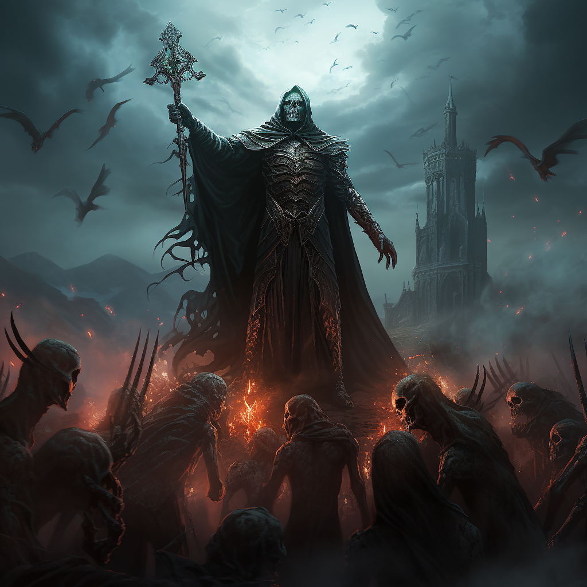

# Nekromancja

Nekromancja pozwala podnosić szkielety oraz poległych przeciwników.

# Zdolności:

S - ilość sukcesów w rzucie kośćmi many

___

**Szkielet**

Zdolność dystansowa, wymaga ciała.

Trudność: Wybrana kość szkieleta ([minion](/docs/boss-i-miniony.md))\
Tworzysz szkielet z S kośćmi.

Szkielet atakuje wręcz - obrażenia fizyczne.
___
**Szkielet Łucznik**

Zdolność dystansowa, wymaga ciała.

Trudność: Wybrana kość szkieleta ([minion](/docs/boss-i-miniony.md))\
Tworzysz szkielet z S kośćmi.

Szkielet atakuje dystansowo - obrażenia fizyczne.
___
**Szkielet Nekromanta**

Zdolność dystansowa, wymaga ciała.\
Trudność: Wybrana kość szkieleta ([minion](/docs/boss-i-miniony.md))\
Bazowy koszt many: 2M

Tworzysz szkielet z S kośćmi.

Szkielet nekromanta może atakować dystansowo - obrażenia od cienia.

Może też tworzyć nowe szkielety.
___
**Podniesienie wroga**

Zdolność dystansowa, wymaga ciała.\
Trudność: Kość życia wroga

Podnosisz wroga. Każdy sukces dodaje 1 kość życia.\
Nie może przekroczyć maksymalnego życia celu.

Możesz wykorzystywać wszystkie jego umiejętności o jakich wiesz że istnieją.

# [Zdolność epicka](/docs/zdolnosc-epicka.md):

**Armia nieumarłych**

Zdolność dystansowa. Wymaga ciał.\
Trudność: Wybrana kość szkieleta\
Bazowy koszt many: 4M

Podnosisz powoli ręce do góry niczym Nocny Król albo nekromanci na filmach.

Wszystkie szkielety w zasięgu wstają aby walczyć po twojej stronie z S kośćmi.

# Talenty

**Szybkie wskrzeszenie:**

Kiedy masz farta w dowolnym rzucie, możesz wykorzystać zdolność Szkielet lub Szkielet Łucznik za wynik tego rzutu.
___
**Twarde kości:**

[Przewaga](/docs/przewaga.md) przy tworzeniu szkieletów.
___
**Szkielety żywiołów:**

Możesz zmienić typ zadawanych obrażeń szkieletów na ogień, lód lub truciznę.

Możesz zwiększyć koszt many o 1M aby szkielety mogły wykorzystywać sukcesy w ataku żeby zamiast obrażeń dodać poziom jednego z efektów:
* [podpalenie](/docs/efekty/podpalenie.md)
* [zmrożenie](/docs/efekty/zmrozenie.md)
* [zatrucie](/docs/efekty/zatrucie.md)
