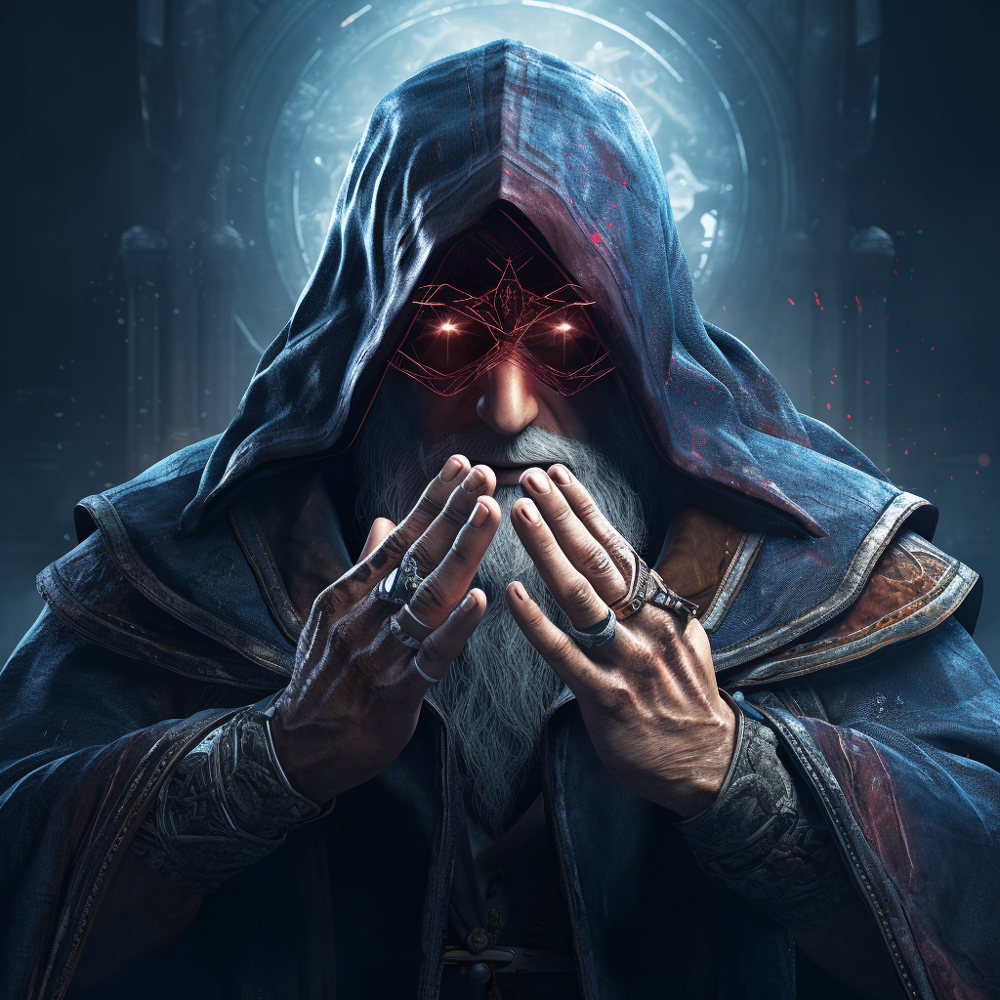
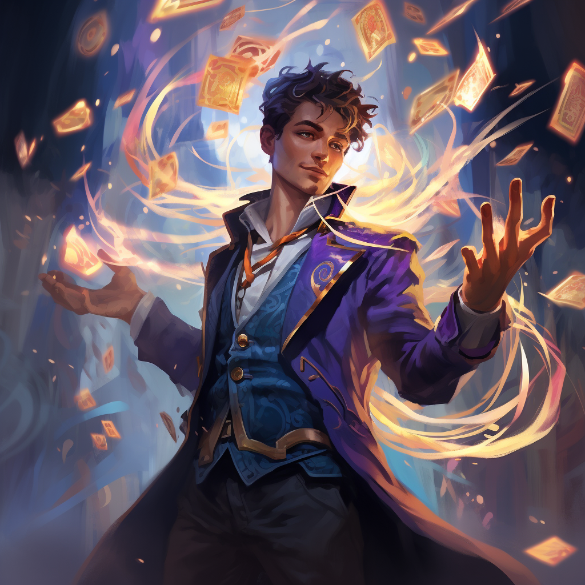
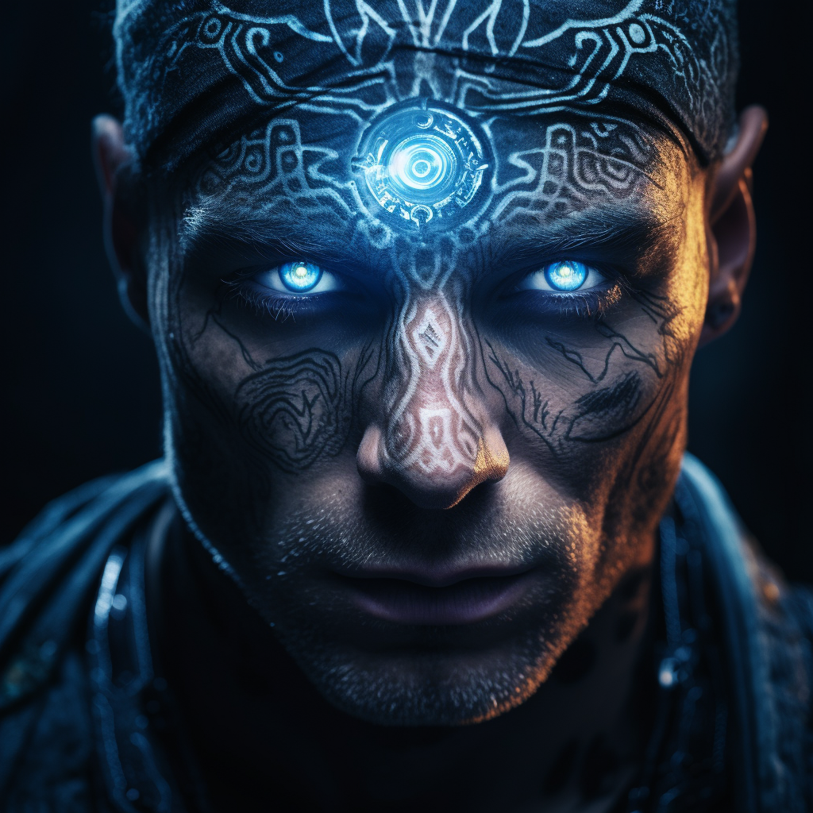
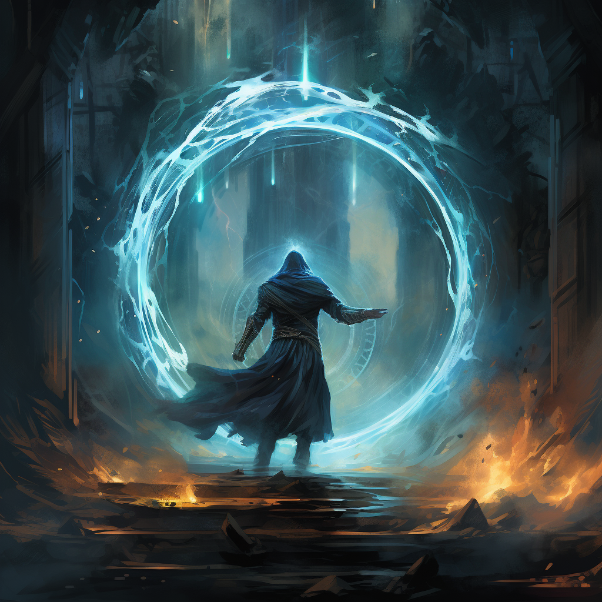

# Zaklinacz

Zaklinacz oszukuje przeciwników iluzjami, kontroluje ich umysły.\
Używa też telekinezy aby pomagać sojusznikom i przeszkadzać wrogom.

# Ścieżki zaklinacza

## [Iluzje](sciezki/iluzje.md)

## [Psionika](sciezki/psionika.md)

## [Telekineza](sciezki/telekineza.md)

